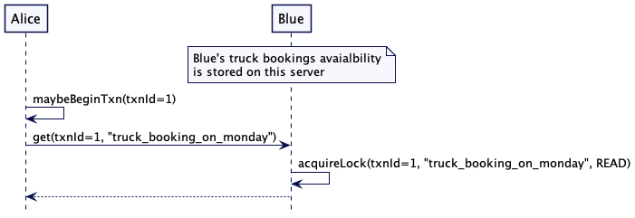
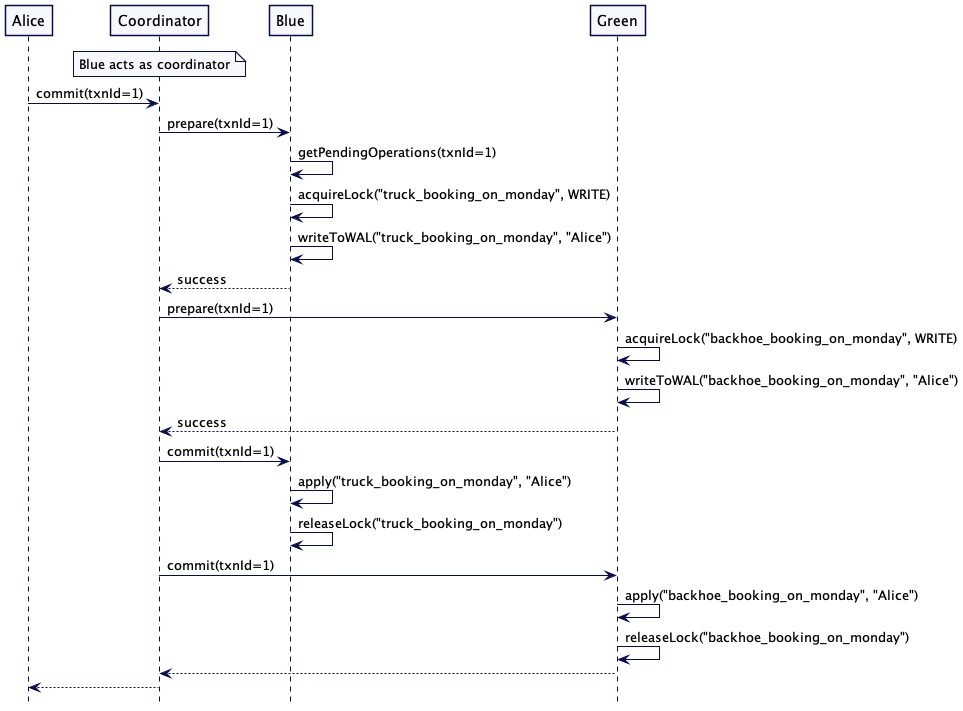
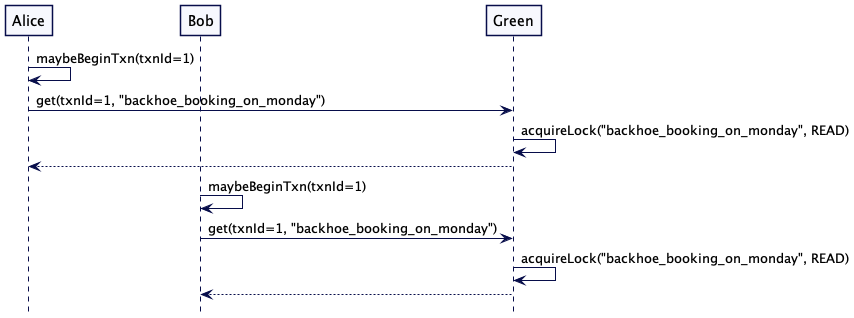
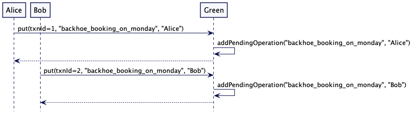
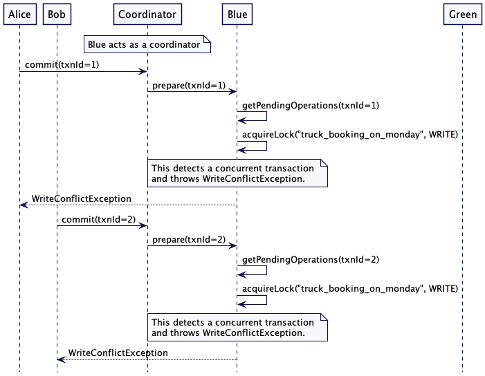
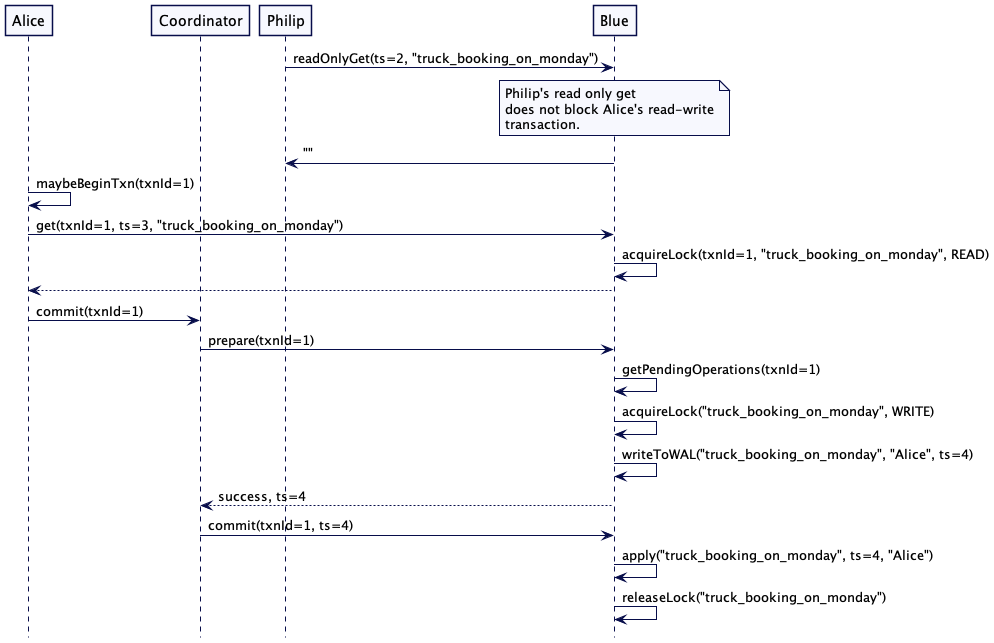

# 两阶段提交（Two Phase Commit）

**原文**

https://martinfowler.com/articles/patterns-of-distributed-systems/two-phase-commit.html

在一个原子操作里更新多个节点的资源。

**2021.1.18**

## 问题

当数据需要在多个集群节点上进行原子化地存储时，集群节点在了解其他集群节点的决定之前，是不能让客户端进行访问数据的。每个节点都需要知道其它的节点是成功地存储数据，还是失败了。

## 解决方案

两阶段提交的本质正如它的名字一样，它将更新操作分为两个阶段：

* 第一阶段，预备，询问每个节点是否能够承诺完成更新。
* 第二阶段，提交，实际执行更新。

在预备阶段，参与事务的每个节点都需要获得所需的任何东西以确保它能够在第二阶段完成提交，例如锁。如果每个节点都能确保它能完成第二阶段的提交，协调者就能得知这是一次有效的更新，并将在第二阶段进行提交。当其中任何一个节点无法做出承诺时，协调者将会通知所有节点回滚，释放它们持有的锁同时事务将终止。也就是说，仅当所有参与者都同意进入下一阶段时，第二阶段才会开始，届时，它们都将成功完成更新。

假设有一个简单的分布式key-value存储，两阶段提交协议的工作原理如下。

事务客户端为事务创建一个唯一标识。客户端还会记下其他的一些细节，比如事务的开始时间。这是用来防止死锁的，后面的锁机制将对此进行描述。

客户机记下的唯一id和其他细节（如开始时间戳）用于跨集群节点引用事务。客户端维护如下的事务引用，该事务引用与客户端的每个请求一起传递给其他节点。

```java
class TransactionRef…

  private UUID txnId;
  private long startTimestamp;


  public TransactionRef(long startTimestamp) {
      this.txnId = UUID.randomUUID();
      this.startTimestamp = startTimestamp;
  }
class TransactionClient…

  TransactionRef transactionRef;

  public TransactionClient(ReplicaMapper replicaMapper, SystemClock systemClock) {
      this.clock = systemClock;
      this.transactionRef = new TransactionRef(clock.now());
      this.replicaMapper = replicaMapper;
  }
```

集群其中的一个节点充当协调者，它将替客户机追踪事务状态走向。在键值存储中，它通常是存储数据的某一个节点。通过客户端保存的第一个key选举。

在存储任何值之前，客户机会通知协调者开启一个事务。因为协调者同时也是存储数据的某个节点，因此get或put操作时，协调者会通过指定的key动态选举。

```java
class TransactionClient…

  private TransactionalKVStore coordinator;
  private void maybeBeginTransaction(String key) {
      if (coordinator == null) {
          coordinator = replicaMapper.serverFor(key);
          coordinator.begin(transactionRef);
      }
  }
```

事务的协调者跟踪事务状态的走向。它通过[预写日志（Write-Ahead Log）](write-ahead-log.md)记录任何变更以保证发生故障时数据仍旧可用。

```java
class TransactionCoordinator…

  Map<TransactionRef, TransactionMetadata> transactions = new ConcurrentHashMap<>();
  WriteAheadLog transactionLog;

  public void begin(TransactionRef transactionRef) {
      TransactionMetadata txnMetadata = new TransactionMetadata(transactionRef, systemClock, transactionTimeoutMs);
      transactionLog.writeEntry(txnMetadata.serialize());
      transactions.put(transactionRef, txnMetadata);
  }
class TransactionMetadata…

  private TransactionRef txn;
  private List<String> participatingKeys = new ArrayList<>();
  private TransactionStatus transactionStatus;
```

客户端将每一个属于事务的 key 发送给协调者。因此协调者知道该事务下所有的 key。协调者将这些 key 记录在事务的元数据下(transaction metadata)。通过这些 key 能知道所有参与事务的集群节点。因为每一个 key-value通常通过[复制日志（Replicated Log）](replicated-log.md)复制。处理某个 key 的 领导 可能会在事务进行中改变。因此使用 key 代替实际的服务器地址来追踪事务的状态。当客户端向服务器发送处理某个 key 的请求，处理请求的服务器是基于分区策略决定的。需要注意的是客户端直接向服务器通信，不经过协调者。从而避免在网络上发送两次数据：从客户端到协调者，再从协调者到各自的服务器。

通过这些 key 能知道所有参与事务的集群节点。因为每一个 key-value通常通过[复制日志（Replicated Log）](replicated-log.md)复制。处理某个 key 的 领导 可能会在事务进行中改变。因此使用 key 来追踪事务的状态要优于使用实际的服务器地址。

```java
class TransactionClient…

  public CompletableFuture<String> get(String key) {
      maybeBeginTransaction(key);
      coordinator.addKeyToTransaction(transactionRef, key);
      TransactionalKVStore kvStore = replicaMapper.serverFor(key);
      return kvStore.get(transactionRef, key);
  }

  public void put(String key, String value) {
      maybeBeginTransaction(key);
      coordinator.addKeyToTransaction(transactionRef, key);
      replicaMapper.serverFor(key).put(transactionRef, key, value);
  }
class TransactionCoordinator…

  public synchronized void addKeyToTransaction(TransactionRef transactionRef, String key) {
      TransactionMetadata metadata = transactions.get(transactionRef);
      if (!metadata.getParticipatingKeys().contains(key)) {
          metadata.addKey(key);
          transactionLog.writeEntry(metadata.serialize());
      }
  }
```

当处理请求的节点检测到该请求存在事务id，是某个事务的一部分。它将负责在事务的状态中存储请求中的键值。键值并不会直接提供给键值存储，而是单独存储。

```java
class TransactionalKVStore…

  public void put(TransactionRef transactionRef, String key, String value) {
      TransactionState state = getOrCreateTransactionState(transactionRef);
      state.addPendingUpdates(key, value);
  }
```

## 锁与事务隔离

请求需要在被执行的 key 上加锁。特别是，get 请求加个读锁，put请求加个写锁。读取值时获取读锁。

```java
class TransactionalKVStore…

  public CompletableFuture<String> get(TransactionRef txn, String key) {
      CompletableFuture<TransactionRef> lockFuture
              = lockManager.acquire(txn, key, LockMode.READ);
      return lockFuture.thenApply(transactionRef -> {
          getOrCreateTransactionState(transactionRef);
          return kv.get(key);
      });
  }

  synchronized TransactionState getOrCreateTransactionState(TransactionRef txnRef) {
      TransactionState state = this.ongoingTransactions.get(txnRef);
      if (state == null) {
          state = new TransactionState();
          this.ongoingTransactions.put(txnRef, state);
      }
      return state;
  }
```

节点仅将更新操作挂起，在事务提交时写入。直到当事务即将提交且值在键值存储中可用时才加写锁。

这种延迟加锁的方式，减少了事务之间冲突。

```java
class TransactionalKVStore…

  public void put(TransactionRef transactionRef, String key, String value) {
      TransactionState state = getOrCreateTransactionState(transactionRef);
      state.addPendingUpdates(key, value);
  }
```

需要注意的是，这些锁在请求完成时不会被释放、只有在事务提交时才被释放。这种在事务期间持有锁，并仅在事务提交或回滚时释放的技巧称为 [两阶段锁定(2PL two-phase-locking)](https://en.wikipedia.org/wiki/Two-phase_locking)。两阶段锁定是串行化隔离级(serializable isolation level)的基石。串行化使得同一时间仅执行一个，从而达到事务的效果。

## 防止死锁

两个事务互相等待对方释放锁会导致死锁。当检测到事务冲突时，不允许等待并立即终止事务即可避免死锁。下面有一些决定能够判断是否终止事务的策略。

锁管理器(Lock Manager)实现了如下策略：

```java
class LockManager…

  WaitPolicy waitPolicy;
```

 `WaitPolicy` 决定当请求发生冲突时，应该做什么。

```java
public enum WaitPolicy {
    WoundWait,
    WaitDie,
    Error
}
```

锁是一个对象，它记录了当前拥有锁的事务和等待该锁的事务。

```
class Lock…

  Queue<LockRequest> waitQueue = new LinkedList<>();
  List<TransactionRef> owners = new ArrayList<>();
  LockMode lockMode;
```

当事务请求获取锁，如果没有冲突，没有事务拥有该锁，则锁管理器会立即将锁授予它。

```java
class LockManager…

  public synchronized CompletableFuture<TransactionRef> acquire(TransactionRef txn, String key, LockMode lockMode) {
      return acquire(txn, key, lockMode, new CompletableFuture<>());
  }

  CompletableFuture<TransactionRef> acquire(TransactionRef txnRef,
                                            String key,
                                            LockMode askedLockMode,
                                            CompletableFuture<TransactionRef> lockFuture) {
      Lock lock = getOrCreateLock(key);

      logger.debug("acquiring lock for = " + txnRef + " on key = " + key + " with lock mode = " + askedLockMode);
      if (lock.isCompatible(txnRef, askedLockMode)) {
          lock.addOwner(txnRef, askedLockMode);
          lockFuture.complete(txnRef);
          logger.debug("acquired lock for = " + txnRef);
          return lockFuture;
      }
class Lock…

  public boolean isCompatible(TransactionRef txnRef, LockMode lockMode) {
      if(hasOwner()) {
          return (inReadMode() && lockMode == LockMode.READ)
                  || isUpgrade(txnRef, lockMode);
      }
      return true;
  }
```

如果发生冲突，锁管理器将会根据等待策略处理。

### 等待策略：Error策略

如果设置Error策略，冲突将会抛出一个错误，该事务将会回滚并等待一段随机时间后重试。

```java
class LockManager…

  private CompletableFuture<TransactionRef> handleConflict(Lock lock,
                                                           TransactionRef txnRef,
                                                           String key,
                                                           LockMode askedLockMode,
                                                           CompletableFuture<TransactionRef> lockFuture) {
      switch (waitPolicy) {
          case Error: {
              lockFuture.completeExceptionally(new WriteConflictException(txnRef, key, lock.owners));
              return lockFuture;
          }
          case WoundWait: {
              return lock.woundWait(txnRef, key, askedLockMode, lockFuture, this);
          }
          case WaitDie: {
              return lock.waitDie(txnRef, key, askedLockMode, lockFuture, this);
          }
      }
      throw new IllegalArgumentException("Unknown waitPolicy " + waitPolicy);
  }
```

在冲突较为激烈、许多事务将会尝试获取锁时，如果失败的事务全部终止并重试。将会严重限制系统的吞吐量。数据存储需要确保尽可能少的事务重试。

一个常用的技巧是给事务分配一个唯一的ID并给它们排序。举个栗子，[Spanner](https://cloud.google.com/spanner)[分配唯一ID](https://dahliamalkhi.github.io/files/SpannerExplained-SIGACT2013b.pdf)以排序事务。这个与[Paxos]()中讨论的跨集群排序请求技术非常相似。一旦事务能够排序，就可以在不重试事务的情况下避免死锁。

事务的引用可以用来排序。一个最简单的方法就是为每一个事务引用分配一个时间戳，并基于时间戳进行比较。

```java
class TransactionRef…

  boolean after(TransactionRef otherTransactionRef) {
      return this.startTimestamp > otherTransactionRef.startTimestamp;
  }
```

但是在分布式系统中，[时钟并不是单调的](lamport-clock.md)，因此可以为每个事务分配一个唯一ID，以便于排序。除了ID之外，还需追踪每个ID的年龄来给事务排序。[Spanner](https://cloud.google.com/spanner)在系统里通过每个事务的年龄来排序事务。

为了能够排序全部事务，每个集群节点被分配一个唯一的ID。当事务开始时，客户端从他们当中选举出一个协调者，并由协调者生成一个事务ID。作为协调者的集群节点生成事务ID如下所示。

```java
class TransactionCoordinator…

  private int requestId;
  public MonotonicId begin() {
      return new MonotonicId(requestId++, config.getServerId());
  }
class MonotonicId…

  public class MonotonicId implements Comparable<MonotonicId> {
      public int requestId;
      int serverId;
  
      public MonotonicId(int requestId, int serverId) {
          this.serverId = serverId;
          this.requestId = requestId;
      }
  
      public static MonotonicId empty() {
          return new MonotonicId(-1, -1);
      }
  
      public boolean isAfter(MonotonicId other) {
          if (this.requestId == other.requestId) {
              return this.serverId > other.serverId;
          }
          return this.requestId > other.requestId;
      }
class TransactionClient…

  private void beginTransaction(String key) {
      if (coordinator == null) {
          coordinator = replicaMapper.serverFor(key);
          MonotonicId transactionId = coordinator.begin();
          transactionRef = new TransactionRef(transactionId, clock.nanoTime());
      }
  }
```

客户端通过开始时间来计算并更新事务年龄。

```java
class TransactionRef…

  public void incrementAge(SystemClock clock) {
      age = clock.nanoTime() - startTimestamp;
  }
```

每当get或者put请求到来时，都会从新计算年龄。事务之间通过年龄来排序，如果不巧两个事务具有相同的年龄，则比较他们的事务ID。

```java
class TransactionRef…

  public boolean isAfter(TransactionRef other) {
       return age == other.age?
                  this.id.isAfter(other.id)
                  :this.age > other.age;
  }
```

### 等待策略：Wound-Wait策略

在 [Wound-Wait](http://www.mathcs.emory.edu/~cheung/Courses/554/Syllabus/8-recv+serial/deadlock-woundwait.html) 策略中，如果发生冲突，则会比较他们的引用。如果锁的持有者都比等待者年轻，则持有者会被终止。但是如果锁的请求者比持有者更年轻，则请求者会继续等待。

```java
class Lock…

  public CompletableFuture<TransactionRef> woundWait(TransactionRef txnRef,
                                                     String key,
                                                     LockMode askedLockMode,
                                                     CompletableFuture<TransactionRef> lockFuture,
                                                     LockManager lockManager) {

      if (allOwningTransactionsStartedAfter(txnRef) && !anyOwnerIsPrepared(lockManager)) {
          abortAllOwners(lockManager, key, txnRef);
          return lockManager.acquire(txnRef, key, askedLockMode, lockFuture);
      }

      LockRequest lockRequest = new LockRequest(txnRef, key, askedLockMode, lockFuture);
      lockManager.logger.debug("Adding to wait queue = " + lockRequest);
      addToWaitQueue(lockRequest);
      return lockFuture;
  }
class Lock…

  private boolean allOwningTransactionsStartedAfter(TransactionRef txn) {
      return owners.stream().filter(o -> !o.equals(txn)).allMatch(owner -> owner.after(txn));
  }
```

需要注意的是，已经处于两阶段提交的准备状态的事务不会被中止。

### 等待策略：Wait-Die 策略

 [Wait-Die](http://www.mathcs.emory.edu/~cheung/Courses/554/Syllabus/8-recv+serial/deadlock-waitdie.html) 的工作方式与 [Wound-Wait](http://www.mathcs.emory.edu/~cheung/Courses/554/Syllabus/8-recv+serial/deadlock-woundwait.html) 完全相反。如果锁所有者都比请求锁的事务年轻，那么所有这些事务都将被中止。但是，如果请求该锁的事务比拥有该锁的事务年轻，那么它将等待该锁。

```java
 class Lock…

  public CompletableFuture<TransactionRef> woundWait(TransactionRef txnRef,
                                                     String key,
                                                     LockMode askedLockMode,
                                                     CompletableFuture<TransactionRef> lockFuture,
                                                     LockManager lockManager) {

      if (allOwningTransactionsStartedAfter(txnRef) && !anyOwnerIsPrepared(lockManager)) {
          abortAllOwners(lockManager, key, txnRef);
          return lockManager.acquire(txnRef, key, askedLockMode, lockFuture);
      }

      LockRequest lockRequest = new LockRequest(txnRef, key, askedLockMode, lockFuture);
      lockManager.logger.debug("Adding to wait queue = " + lockRequest);
      addToWaitQueue(lockRequest);
      return lockFuture;
  }
class Lock…

  private boolean allOwningTransactionsStartedAfter(TransactionRef txn) {
      return owners.stream().filter(o -> !o.equals(txn)).allMatch(owner -> owner.after(txn));
  }
```

需要注意的是，已经处于两阶段提交的准备状态的事务不会被中止。

## 提交和回滚

一旦客户端在没有遇到任何冲突的情况下成功读取并写入所有键值，它就会通过向协调者发送提交请求来发起提交请求。

```java
class TransactionClient…

  public CompletableFuture<Boolean> commit() {
      return coordinator.commit(transactionRef);
  }
```

协调者将事务的状态记录为准备提交。协调者把提交分两个阶段处理。

* 首先向每个参与者发送预备请求。
* 一旦协调者收到所有参与者都成功的回复了预备请求。协调者将会把事务标记为完成，同时对所有参与者发送提交请求。

```java
class TransactionCoordinator…

  public CompletableFuture<Boolean> commit(TransactionRef transactionRef)  {
      TransactionMetadata metadata = transactions.get(transactionRef);
      metadata.markPreparingToCommit(transactionLog);
      List<CompletableFuture<Boolean>> allPrepared = sendPrepareRequestToParticipants(transactionRef);
      CompletableFuture<List<Boolean>> futureList = sequence(allPrepared);
      return futureList.thenApply(result -> {
          if (!result.stream().allMatch(r -> r)) {
              logger.info("Rolling back = " + transactionRef);
              rollback(transactionRef);
              return false;
          }
          metadata.markPrepared(transactionLog);
          sendCommitMessageToParticipants(transactionRef);
          metadata.markCommitComplete(transactionLog);
          return true;
      });
  }

  public List<CompletableFuture<Boolean>> sendPrepareRequestToParticipants(TransactionRef transactionRef)  {
      TransactionMetadata transactionMetadata = transactions.get(transactionRef);
      var transactionParticipants = getParticipants(transactionMetadata.getParticipatingKeys());
      return transactionParticipants.keySet()
              .stream()
              .map(server -> server.handlePrepare(transactionRef))
              .collect(Collectors.toList());
  }

  private void sendCommitMessageToParticipants(TransactionRef transactionRef) {
      TransactionMetadata transactionMetadata = transactions.get(transactionRef);
      var participantsForKeys = getParticipants(transactionMetadata.getParticipatingKeys());
      participantsForKeys.keySet().stream()
              .forEach(kvStore -> {
                  List<String> keys = participantsForKeys.get(kvStore);
                  kvStore.handleCommit(transactionRef, keys);
              });
  }

  private Map<TransactionalKVStore, List<String>> getParticipants(List<String> participatingKeys) {
      return participatingKeys.stream()
              .map(k -> Pair.of(serverFor(k), k))
              .collect(Collectors.groupingBy(Pair::getKey, Collectors.mapping(Pair::getValue, Collectors.toList())));
  }
```

接收到准备预备请求的参与者做两件事:

* 试图获取被挂起请求相关键的写锁。
* 一旦成功，它会将所有更改写入[预写日志](write-ahead-log.md)。

如果成功的完成这两件事，该参与者就能保证不会与其他事务发生冲突。并在节点突然崩溃的情况下恢复完成事务所需的一切状态。

```java
class TransactionalKVStore…

  public synchronized CompletableFuture<Boolean> handlePrepare(TransactionRef txn) {
      try {
          TransactionState state = getTransactionState(txn);
          if (state.isPrepared()) {
              return CompletableFuture.completedFuture(true); //already prepared.
          }

          if (state.isAborted()) {
              return CompletableFuture.completedFuture(false); //aborted by another transaction.
          }

          Optional<Map<String, String>> pendingUpdates = state.getPendingUpdates();
          CompletableFuture<Boolean> prepareFuture = prepareUpdates(txn, pendingUpdates);
          return prepareFuture.thenApply(ignored -> {
              Map<String, Lock> locksHeldByTxn = lockManager.getAllLocksFor(txn);
              state.markPrepared();
              writeToWAL(new TransactionMarker(txn, locksHeldByTxn, TransactionStatus.PREPARED));
              return true;
          });

      } catch (TransactionException| WriteConflictException e) {
          logger.error(e);
      }
      return CompletableFuture.completedFuture(false);
  }

  private CompletableFuture<Boolean> prepareUpdates(TransactionRef txn, Optional<Map<String, String>> pendingUpdates)  {
      if (pendingUpdates.isPresent()) {
          Map<String, String> pendingKVs = pendingUpdates.get();
          CompletableFuture<List<TransactionRef>> lockFuture = acquireLocks(txn, pendingKVs.keySet());
          return lockFuture.thenApply(ignored -> {
              writeToWAL(txn, pendingKVs);
              return true;
          });
      }
      return CompletableFuture.completedFuture(true);
  }

  TransactionState getTransactionState(TransactionRef txnRef) {
      return ongoingTransactions.get(txnRef);
  }

  private void writeToWAL(TransactionRef txn, Map<String, String> pendingUpdates) {
     for (String key : pendingUpdates.keySet()) {
          String value = pendingUpdates.get(key);
          wal.writeEntry(new SetValueCommand(txn, key, value).serialize());
      }
  }

  private CompletableFuture<List<TransactionRef>> acquireLocks(TransactionRef txn, Set<String> keys) {
      List<CompletableFuture<TransactionRef>> lockFutures = new ArrayList<>();
      for (String key : keys) {
          CompletableFuture<TransactionRef> lockFuture = lockManager.acquire(txn, key, LockMode.READWRITE);
          lockFutures.add(lockFuture);
      }
      return sequence(lockFutures);
  }
```

当参与者收到协调者的提交消息时，就标志着到了让修改键值更改可用的时机。参与者在提交更改时做了三件事:

* 参与者将事务标记为已提交。如果集群节点此时发生故障，由于参与者已经知道事务的结果，恢复后重复以下步骤。
* 它将所有更改应用到键值存储。
* 它将释放所有已经获得得锁。

```java
class TransactionalKVStore…

  public synchronized void handleCommit(TransactionRef transactionRef, List<String> keys) {
      if (!ongoingTransactions.containsKey(transactionRef)) {
          return; //this is a no-op. Already committed.
      }

      if (!lockManager.hasLocksFor(transactionRef, keys)) {
          throw new IllegalStateException("Transaction " + transactionRef + " should hold all the required locks for keys " + keys);
      }

      writeToWAL(new TransactionMarker(transactionRef, TransactionStatus.COMMITTED, keys));

      applyPendingUpdates(transactionRef);

      releaseLocks(transactionRef, keys);
  }

  private void removeTransactionState(TransactionRef txnRef) {
      ongoingTransactions.remove(txnRef);
  }


  private void applyPendingUpdates(TransactionRef txnRef) {
      TransactionState state = getTransactionState(txnRef);
      Optional<Map<String, String>> pendingUpdates = state.getPendingUpdates();
      apply(txnRef, pendingUpdates);
  }

  private void apply(TransactionRef txnRef, Optional<Map<String, String>> pendingUpdates) {
      if (pendingUpdates.isPresent()) {
          Map<String, String> pendingKv = pendingUpdates.get();
          apply(pendingKv);
      }
      removeTransactionState(txnRef);
  }

  private void apply(Map<String, String> pendingKv) {
      for (String key : pendingKv.keySet()) {
          String value = pendingKv.get(key);
          kv.put(key, value);
      }
  }
  private void releaseLocks(TransactionRef txn, List<String> keys) {
          lockManager.release(txn, keys);
  }

  private Long writeToWAL(TransactionMarker transactionMarker) {
     return wal.writeEntry(transactionMarker.serialize());
  }
```

回滚得方式与之类似，如果发生任何失败，客户端告诉协调者回滚事务。

```java
class TransactionClient…

  public void rollback() {
      coordinator.rollback(transactionRef);
  }
```

协调者将事务的状态记录为预备回滚。然后，它将给所有事务有关的键值存储服务发送回滚请求。一旦所有请求都成功，协调者将事务回滚标记为完成。如果协调者在事务被标记为“预备回滚”后崩溃，恢复后可以继续向所有参与的集群节点发送回滚消息。

```java
class TransactionCoordinator…

  public void rollback(TransactionRef transactionRef) {
      transactions.get(transactionRef).markPrepareToRollback(this.transactionLog);

      sendRollbackMessageToParticipants(transactionRef);

      transactions.get(transactionRef).markRollbackComplete(this.transactionLog);
  }

  private void sendRollbackMessageToParticipants(TransactionRef transactionRef) {
      TransactionMetadata transactionMetadata = transactions.get(transactionRef);
      var participants = getParticipants(transactionMetadata.getParticipatingKeys());
      for (TransactionalKVStore kvStore : participants.keySet()) {
          List<String> keys = participants.get(kvStore);
          kvStore.handleRollback(transactionMetadata.getTxn(), keys);
      }
  }
```

参与者收到回滚请求时做三件事：

* 它在预写日志中记录回滚时事务的状态。
* 它丢弃事务状态。
* 它将释放所有已经获得得锁。

```java
class TransactionalKVStore…

  public synchronized void handleRollback(TransactionRef transactionRef, List<String> keys) {
      if (!ongoingTransactions.containsKey(transactionRef)) {
          return; //no-op. Already rolled back.
      }
      writeToWAL(new TransactionMarker(transactionRef, TransactionStatus.ROLLED_BACK, keys));
      this.ongoingTransactions.remove(transactionRef);
      this.lockManager.release(transactionRef, keys);
  }
```

### 幂等操作

协调者可能重试准备、提交或回滚请求。所以这些操作必须是[幂等](idempotent-receiver.md)的。

### 示例场景

#### 原子写

考虑以下场景。Blue 有一辆卡车，Green 有一辆挖土机。卡车和挖土机的可用性和预订状态存储在分布式键值存储中。根据 key 映射到服务器的方式，Blue的卡车和Green的挖土机订单存储在单独的集群节点上。Alice 正试图预订一辆卡车和挖土机。卡车和挖土机要么同时订到，要么同时取消。

预订场景如下所示。

通过读取 key 'truck_booking_monday' 和 'backhoe_booking_monday', Alice 检查了 Blue 的卡车和 Green 的挖土机。


<center>检查卡车</center>


<center>检查挖土机</center>

如果值为空，则表示可以预定。她预定了卡车和挖土机。重要的是，设置这两个值的操作需要保证原子性，如果出现任何失败，就不能设置任何值。

提交分为两个阶段。Alice 请求的第一个服务器充当协调者并执行这两个阶段。


<center>提交成功</center>

_协调者在序列图中表示为一个独立的参与者，然而协调协调者通常由其中一个服务器担任，因此在实际操作上一个服务器会同时担任两个角色（参与者与协调者）。_

#### 事务冲突

考虑这样一个场景， Bob 也试图在同一个周一预订一辆卡车和挖掘机来施工。

预订场景如下所示：

* Alice 和 Bob 都去读key 'truck_booking_monday' 和 'backhoe_booking_monday'
* 他俩都看到值为空，都觉得可以预定。
* 他俩都想预定卡车和挖土机。

因为事务是互相冲突的，我们的期望是，仅存在 Alice 或者 Bob 一个人去预定，而不是他们各拿一半。在出现冲突的情况下，需要重新尝试整个流程，他们当然都希望能够继续进行预订。但在任何情况下，预订都不能部分完成。要么两个预订都应该完成，要么两个预订都不完成。

为了检查是否能够预定，Alice 和 Bob 都发起一个事务，并分别联系 Blue 和 Green 的服务器来检查预定状态。Blue 持有'truck_booking_on_monday' 的读锁，Green持有'backhoe_booking_on_monday' 的读锁。因为读锁是共享的，所以Alice和Bob都可以读取这些值。




Alice 和 Bob 发现挖掘机和卡车在周一都能订。所以它们通过向服务器发送put请求来预定。两个服务器都将put请求保存在临时存储中。




当Alice和Bob决定提交事务时 —— 假设Blue充当协调者 —— 协调者发起两阶段提交协议，并将准备请求发送给自己和Green。

对于 Alice 的请求，它试图获取 'truck_booking_on_monday' 的写锁，但无法获得，因为另一个事务获取了一个冲突的读锁。所以Alice的事务在准备阶段失败了。Bob的请求上也是如此。



事务可以通过如下循环重试:

```java
class TransactionExecutor…

  public boolean executeWithRetry(Function<TransactionClient, Boolean> txnMethod, ReplicaMapper replicaMapper, SystemClock systemClock) {
      for (int attempt = 1; attempt <= maxRetries; attempt++) {
          TransactionClient client = new TransactionClient(replicaMapper, systemClock);
          try {
              boolean checkPassed = txnMethod.apply(client);
              Boolean successfullyCommitted = client.commit().get();
              return checkPassed && successfullyCommitted;
          } catch (Exception e) {
              logger.error("Write conflict detected while executing." + client.transactionRef + " Retrying attempt " + attempt);
              client.rollback();
              randomWait(); //wait for random interval
          }

      }
      return false;
  }
```

Alice和Bob的预订代码示例如下:

```java
class TransactionalKVStoreTest…

  @Test
  public void retryWhenConflict() {
      List<TransactionalKVStore> allServers = createTestServers(WaitPolicy.WoundWait);

      TransactionExecutor aliceTxn = bookTransactionally(allServers, "Alice", new TestClock(1));
      TransactionExecutor bobTxn = bookTransactionally(allServers, "Bob", new TestClock(2));

      TestUtils.waitUntilTrue(() -> (aliceTxn.isSuccess() && !bobTxn.isSuccess()) || (!aliceTxn.isSuccess() && bobTxn.isSuccess()), "waiting for one txn to complete", Duration.ofSeconds(50));
  }

  private TransactionExecutor bookTransactionally(List<TransactionalKVStore> allServers, String user, SystemClock systemClock) {
      List<String> bookingKeys = Arrays.asList("truck_booking_on_monday", "backhoe_booking_on_monday");
      TransactionExecutor t1 = new TransactionExecutor(allServers);
      t1.executeAsyncWithRetry(txnClient -> {
          if (txnClient.isAvailable(bookingKeys)) {
              txnClient.reserve(bookingKeys, user);
              return true;
          }
          return false;
      }, systemClock);
      return t1;
  }
```

在这种情况下，其中一个事务将最终成功，而另一个将退出。

虽然上述代码很容易实现，但使用了Error Wait策略，会有多个事务重启，从而降低了总吞吐量。

如上一节所述，使用了Wound-Wait策略会减少事务重试。在上面的例子中，在发生冲突的情况下，只有一个事务可能会重新重试，而不是两个事务都重新重试。

### 使用 [有版本的值（Versioned Value）](versioned-value.md)

冲突给读和写带来了很大的限制，尤其是当事务只读的时候。最理想的情况是：只读的事务可在不持有任何锁的情况下，仍能保证事务中读到的值不会随着并发读写事务而改变。

如[有版本的值（Versioned Value）](versioned-value.md)中所述，数据存储通常存储数据的多个版本。版本号通常使用[Lamport 时钟（Lamport Clock）](lamport-clock.md)时间戳。[混合时钟（Hybrid Clock）](hybrid-clock.md)通常用于[MongoDB](https://www.MongoDb.com/)或[CockroachDB](https://www.cockroachlabs.com/docs/stable/)等数据库。

带版本的值与两阶段提交协议结合使用：在预备阶段，参与事务的每个服务器都向协调者发送它能写入值的时间戳。协调者选择这些时间戳中的最大值作为提交时间戳，并发送给参与者。然后，参与者将值写在该时间戳所对应的位置。因为它保证事务以最大时间戳写入值，旧时间戳所对应的值永远不会改变，所以读请求不需要加锁。

考虑如下的一个简单示例： Philip 正在运行一份报表，需要读时间戳 2 之前的数据。这是一个持有锁的长时间操作，因此直到Philip的工作完成，预订卡车的 Alice 都会被阻塞。使用[有版本的值（Versioned Value）](versioned-value.md), Philip 的 get 请求可以在时间戳 2 上继续，而 Alice 的 booking 在时间戳 4 上继续。


<center>多版本并发控制读取(MVCC)</center>

需要注意的是，对于存在读写操作的事务，读请求仍然需要获取读锁。

[Lamport 时钟（Lamport Clock）](lamport-clock.md)实现的示例代码如下所示:

```java
class MvccTransactionalKVStore…

  public String readOnlyGet(String key, long readTimestamp) {
      adjustServerTimestamp(readTimestamp);
      return kv.get(new VersionedKey(key, readTimestamp));
  }

  public CompletableFuture<String> get(TransactionRef txn, String key, long readTimestamp) {
      adjustServerTimestamp(readTimestamp);
      CompletableFuture<TransactionRef> lockFuture = lockManager.acquire(txn, key, LockMode.READ);
      return lockFuture.thenApply(transactionRef -> {
          getOrCreateTransactionState(transactionRef);
          return kv.get(key);
      });
  }

  private void adjustServerTimestamp(long readTimestamp) {
      this.timestamp = readTimestamp > this.timestamp ? readTimestamp:timestamp;
  }

  public void put(TransactionRef txnId, String key, String value) {
      timestamp = timestamp + 1;
      TransactionState transactionState = getOrCreateTransactionState(txnId);
      transactionState.addPendingUpdates(key, value);
  }
class MvccTransactionalKVStore…

  private long prepare(TransactionRef txn, Optional<Map<String, String>> pendingUpdates) throws WriteConflictException, IOException {
      if (pendingUpdates.isPresent()) {
          Map<String, String> pendingKVs = pendingUpdates.get();

          acquireLocks(txn, pendingKVs);

          timestamp = timestamp + 1; //increment the timestamp for write operation.

          writeToWAL(txn, pendingKVs, timestamp);
       }
      return timestamp;
  }
class MvccTransactionCoordinator…

  public long commit(TransactionRef txn) {
          long commitTimestamp = prepare(txn);

          TransactionMetadata transactionMetadata = transactions.get(txn);
          transactionMetadata.markPreparedToCommit(commitTimestamp, this.transactionLog);

          sendCommitMessageToAllTheServers(txn, commitTimestamp, transactionMetadata.getParticipatingKeys());

          transactionMetadata.markCommitComplete(transactionLog);

          return commitTimestamp;
  }


  public long prepare(TransactionRef txn) throws WriteConflictException {
      TransactionMetadata transactionMetadata = transactions.get(txn);
      Map<MvccTransactionalKVStore, List<String>> keysToServers = getParticipants(transactionMetadata.getParticipatingKeys());
      List<Long> prepareTimestamps = new ArrayList<>();
      for (MvccTransactionalKVStore store : keysToServers.keySet()) {
          List<String> keys = keysToServers.get(store);
          long prepareTimestamp = store.prepare(txn, keys);
          prepareTimestamps.add(prepareTimestamp);
      }
      return prepareTimestamps.stream().max(Long::compare).orElse(txn.getStartTimestamp());
  }
```

然后，所有参与者将在提交时间戳上存取。

```java
class MvccTransactionalKVStore…

  public void commit(TransactionRef txn, List<String> keys, long commitTimestamp) {
      if (!lockManager.hasLocksFor(txn, keys)) {
          throw new IllegalStateException("Transaction should hold all the required locks");
      }

      adjustServerTimestamp(commitTimestamp);

      applyPendingOperations(txn, commitTimestamp);

      lockManager.release(txn, keys);

      logTransactionMarker(new TransactionMarker(txn, TransactionStatus.COMMITTED, commitTimestamp, keys, Collections.EMPTY_MAP));
  }

  private void applyPendingOperations(TransactionRef txnId, long commitTimestamp) {
      Optional<TransactionState> transactionState = getTransactionState(txnId);
      if (transactionState.isPresent()) {
          TransactionState t = transactionState.get();
          Optional<Map<String, String>> pendingUpdates = t.getPendingUpdates();
          apply(txnId, pendingUpdates, commitTimestamp);
      }
  }

  private void apply(TransactionRef txnId, Optional<Map<String, String>> pendingUpdates, long commitTimestamp) {
      if (pendingUpdates.isPresent()) {
          Map<String, String> pendingKv = pendingUpdates.get();
          apply(pendingKv, commitTimestamp);
      }
      ongoingTransactions.remove(txnId);
  }


  private void apply(Map<String, String> pendingKv, long commitTimestamp) {
      for (String key : pendingKv.keySet()) {
          String value = pendingKv.get(key);
          kv.put(new VersionedKey(key, commitTimestamp), value);
      }
  }
```

#### 一些技术问题

这里还有的问题需要解决，任何写操作的时间戳都不应该低于已经响应的时间戳。

有好几种实现方式都能保证这一点：[Google Percolator](https://research.google/pubs/pub36726/)和受其启发的[TiKV](https://tikv.org/)使用了一个名为Timestamp oracle的独立服务器，提供单调的时间戳。

[MongoDb](https://www.MongoDb.com/)、[CockroachDb](https://www.cockroachlabs.com/docs/stable/) 等数据库使用[混合时钟（Hybrid Clock）](hybrid-clock.md)来保证这一点，因为每个请求都会调整每个服务器上的混合时钟，保持混合时钟始终为最新的。时间戳也会随着每次写请求而单调地增加。最后，提交阶段在所有参与的服务器中选取最大的时间戳，确保写操作始终在之前的读请求之后。

需要注意的是，如果客户端读取的时间戳值比服务器写入的时间戳早，没有问题。但是如果客户端正在按特定时间戳读取数据，而服务器正要按特定的时间戳写入数据，就有问题了。服务器会检测这种情况，并终止写操作。

### 使用[复制日志（Replicated Log）](replicated-log.md)

使用[复制日志（Replicated Log）](replicated-log.md)能够提升集群的容错。协调者使用复制日志来存储事务日志。

考虑到上面一节中的 Alice 和 Bob 的例子，Blue 服务器是一组服务器，Green服务器也是一组。所有预订数据将在一组服务器上复制。作为两阶段提交的一部分，每个请求都会发送给服务器组的 领导。复制是使用[复制日志（Replicated Log）](replicated-log.md)实现的。

客户端与每组服务器的领导通信，只有当客户端决定提交事务时，一组服务器才需要复制，因此复制也属于预备请求。

协调者也将每个状态更改同步到复制的日志中。

在分布式数据存储中，每个集群节点都会有多个分区。每个分区都会维护一个[复制日志（Replicated Log）](replicated-log.md)，当使用[Raft](https://raft.github.io/) 时，它有时被称为[MultiRaft](https://www.cockroachlabs.com/blog/scaling-raft/)。

### 错误处理

两段式提交协议很大程度上依赖协调者。直到知道事务的结果之前，参与者都不会放弃已拿到的写锁，集群的节点会一直阻塞。这对协调者提出了很高的要求：

即使在进程崩溃的情况下，协调者也需要记住事务的状态。

协调者使用[预写日志（Write-Ahead Log）](write-ahead-log.md)记录事务更新。这样即使崩溃，协调者也能恢复并继续工作。

```java
class TransactionCoordinator…

  public void loadTransactionsFromWAL() throws IOException {
      List<WALEntry> walEntries = this.transactionLog.readAll();
      for (WALEntry walEntry : walEntries) {
          TransactionMetadata txnMetadata = (TransactionMetadata) Command.deserialize(new ByteArrayInputStream(walEntry.getData()));
          transactions.put(txnMetadata.getTxn(), txnMetadata);
      }
      startTransactionTimeoutScheduler();
      completePreparedTransactions();
  }
  private void completePreparedTransactions() throws IOException {
      List<Map.Entry<TransactionRef, TransactionMetadata>> preparedTransactions
              = transactions.entrySet().stream().filter(entry -> entry.getValue().isPrepared()).collect(Collectors.toList());
      for (Map.Entry<TransactionRef, TransactionMetadata> preparedTransaction : preparedTransactions) {
          TransactionMetadata txnMetadata = preparedTransaction.getValue();
          sendCommitMessageToParticipants(txnMetadata.getTxn());
      }
  }
```

参与者也可能在没有告知协调者的情况下崩溃。

协调者会跟踪事务状态的更新时间，如果在配置的时间内事务状态没有发生变化，协调者则会通知参与者回滚。

```java
class TransactionCoordinator…

  private ScheduledThreadPoolExecutor scheduler = new ScheduledThreadPoolExecutor(1);
  private ScheduledFuture<?> taskFuture;
  private long transactionTimeoutMs = Long.MAX_VALUE; //for now.

  public void startTransactionTimeoutScheduler() {
      taskFuture = scheduler.scheduleAtFixedRate(() -> timeoutTransactions(),
              transactionTimeoutMs,
              transactionTimeoutMs,
              TimeUnit.MILLISECONDS);
  }

  private void timeoutTransactions() {
      for (TransactionRef txnRef : transactions.keySet()) {
          TransactionMetadata transactionMetadata = transactions.get(txnRef);
          long now = systemClock.nanoTime();
          if (transactionMetadata.hasTimedOut(now)) {
              sendRollbackMessageToParticipants(transactionMetadata.getTxn());
              transactionMetadata.markRollbackComplete(transactionLog);
          }
      }
  }
```

### 跨异构系统的事务

这里讨论的解决方案时同构系统的两段式提交实现，同构意味着存储相同类型的数据。比如分布式数据库 [MongoDb](https://www.MongoDb.com/) 与 分布式消息中间件 [Kafka](https://kafka.apache.org/)。

在过去，主要讨论的是异构系统的上的两阶段提交。两阶段提交最常见的用法是使用[XA](https://pubs.opengroup.org/onlinepubs/009680699/toc.pdf)事务。跨数据库使用两阶段提交在J2EE服务器中非常常见。

如上所述，协调者需要有强大的容错保证。对于XA事务而言，协调者主要是进行数据库调用的应用程序。在大多数情况下，应用程序都是运行在容器化环境中的无状态微服务。它并不适合作为协调者：协调者是有状态的。

### 示例

像 [CockroachDb](https://www.cockroachlabs.com/docs/stable/)，[MongoDb](https://www.MongoDb.com/)这样的分布式数据库。利用两段式提交实现了跨分区的原子操作。

[Kafka](https://kafka.apache.org/)通过类似两段式提交的方式保证生产消息跨多个分区的原子性。